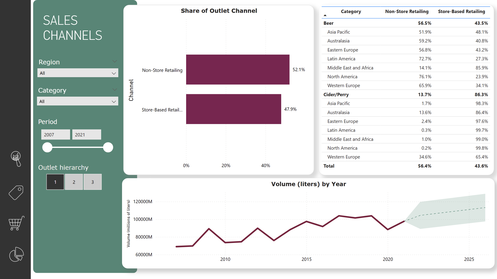

# Dragonyte Brewery | Data Analysis and Visualization
***
## Overview
This project was developed as part of the BeCode AI & Data Science Bootcamp. The goal was to analyze market trends for Dragonyte Brewery and provide actionable insights using Power BI.

## Business Requirements
The project aims to:
* Perform data cleaning and modeling.
* Answer key business questions:
    * What categories/subcategories are projected to grow the fastest in the next five years?
    * Within these categories/subcategories, what channels are growing?
    * What is Dragonyte’s market position within these fast-growing categories?
* Provide predictions and explanations of the model used.
* Give recommendations to the Dragonyte Board.
* Encourage creative thinking and innovative approaches.

## Power BI Report

This Power BI report provides insights into the global market and the Dragonyte Brewery's performance. The report is divided into four main sections:

* Global Market Overview:
This section presents a detailed analysis of the global market, including a volume forecast and retail sale price projections for the next five years.

* Dragonyte Brewery Categories:
This section focuses on Dragonyte Brewery's product categories, with year-over-year growth analysis and forecasts. We also compare our predictions with the input data's forecasts. We reclassify the market categories into Dragonyte Brewery's specific categories for accurate alignment.

* Outlet Channel Share and Forecast:
Here, we analyze the share of different outlet channels in the market and provide a forecast for the next five years.

* Fast-Growing Companies and Market Position:
This section highlights the performance of fast-growing companies and assesses the client’s market position.

## Contributors

Kevin Potter | [kvnpotter](https://github.com/kvnpotter)  
Jessica Rojas-Alvarado | [jessrojasal](https://github.com/jessrojasal)
Olha Slutska | [StefVandekerckhove1](https://github.com/StefVandekerckhove1)  
Stef Vandekerckhove | [olhasl](https://github.com/olhasl)

